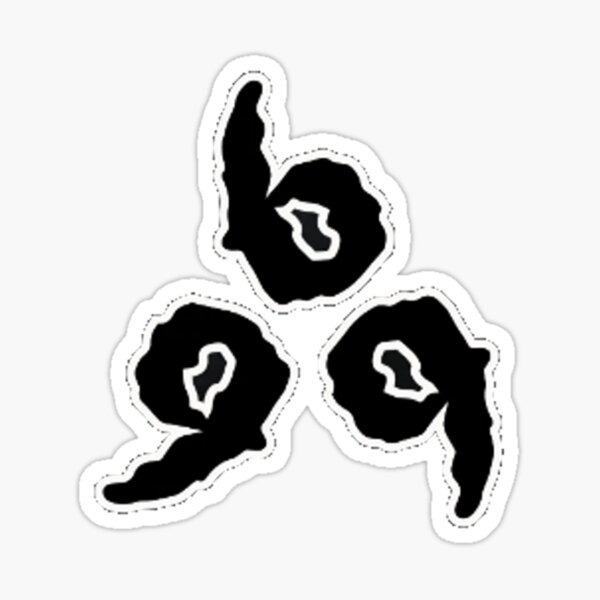
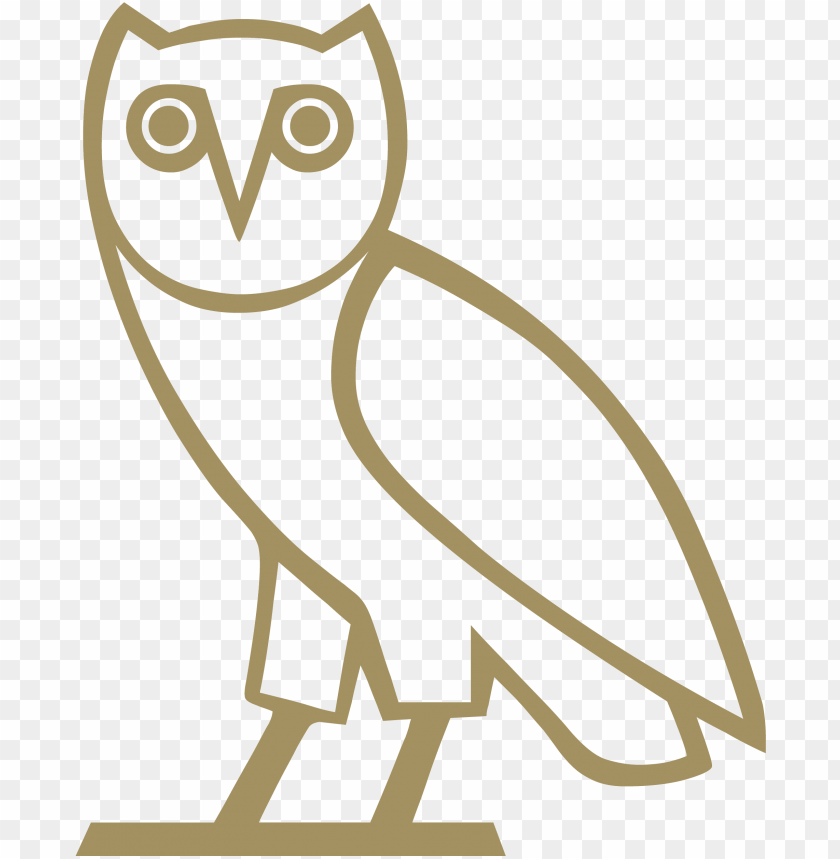
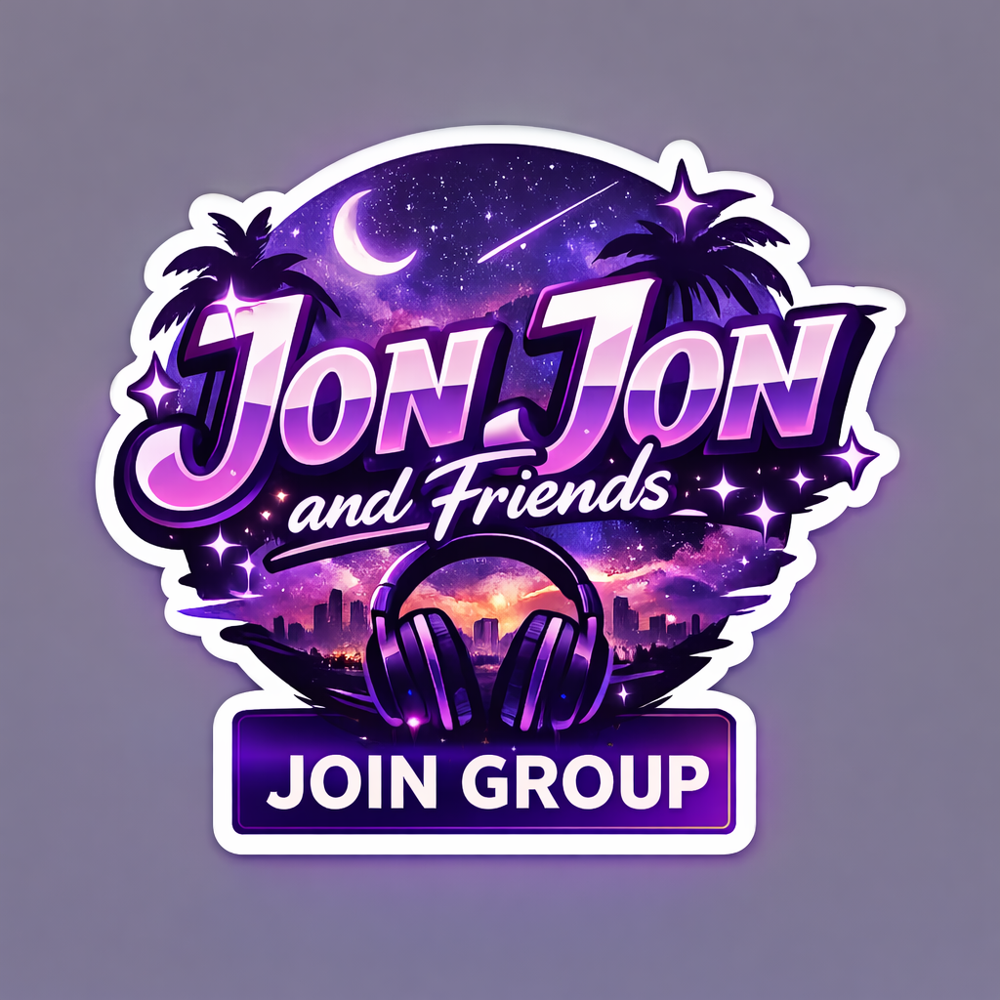

<!DOCTYPE html>
<html lang="en">
<head>
    <meta charset="UTF-8">
    <meta name="viewport" content="width=device-width, initial-scale=1.0">
    <title>JON JON & FRIENDS | THE NEXUS</title>
    
    <link href="https://fonts.googleapis.com/css2?family=Syncopate:wght@400;700&family=Inter:wght@300;900&family=Space+Mono&display=swap" rel="stylesheet">
    
</head>
<body>

    

    

        

            <h1 class="text-3xl md:text-6xl font-sync font-black uppercase italic text-white tracking-tighter">Searching for the Light</h1>
            
Tap to Transcend

        

    

    

        

            
        

        
        

            

                

            

            
Syncing...

        

        

            
        

    

    

        

        

            
999 FOREVER // OVO SOUND SYSTEM // CONNECTING... // NO NEGATIVITY // 

        

        <header class="flex flex-col items-center pt-12 pb-8 px-6 text-center">
            
            <h1 class="text-4xl md:text-7xl font-sync font-bold uppercase italic tracking-tighter">The Inner Circle</h1>
        </header>

        <section class="w-full py-8 overflow-hidden bg-white/5 border-y border-white/5 mb-8">
            

                

                

                

                

                

                

                

                

                

            

        </section>

        <main class="max-w-6xl mx-auto px-6 grid grid-cols-1 md:grid-cols-4 gap-4 pb-24">
            

                <h3 class="font-sync text-[10px] mb-4 text-purple-400 uppercase tracking-widest">Core Mission</h3>
                
"Turning negativity into something positive. Late night melodies, palm trees, and the family that never sleeps."

            

            

                <h3 class="font-sync text-[10px] mb-2 text-gray-500 uppercase">System Status</h3>
                
Online

                
Uptime 99.9%

            

            

                <h3 class="font-sync text-[10px] mb-4 text-blue-400 uppercase font-bold">Session</h3>
                
Tuesdays Active Thursdays Variable Weekend Collective

            

            

                
JJ

                

                    
Jon Jon

                    
Owner

                    
JonnyM85

                

            

            

                
AM

                

                    
Aubrey Graham

                    
Co-Owner

                    
Mikey

                

            

            

                

01

McDonald's

                

02

Optimize Box

                

03

Among Us

            

        </main>

        <footer class="text-center pb-20">
            <button onclick="window.open('https://vrchat.com/home/group/grp_e6ecca5a-828b-4706-9c23-db1723469436')" class="bg-white text-black px-10 py-5 rounded-full font-sync text-sm font-bold uppercase italic hover:scale-105 transition-transform">Join Collective</button>
            
Legends Never Die

        </footer>
    

    
</body>
</html>
